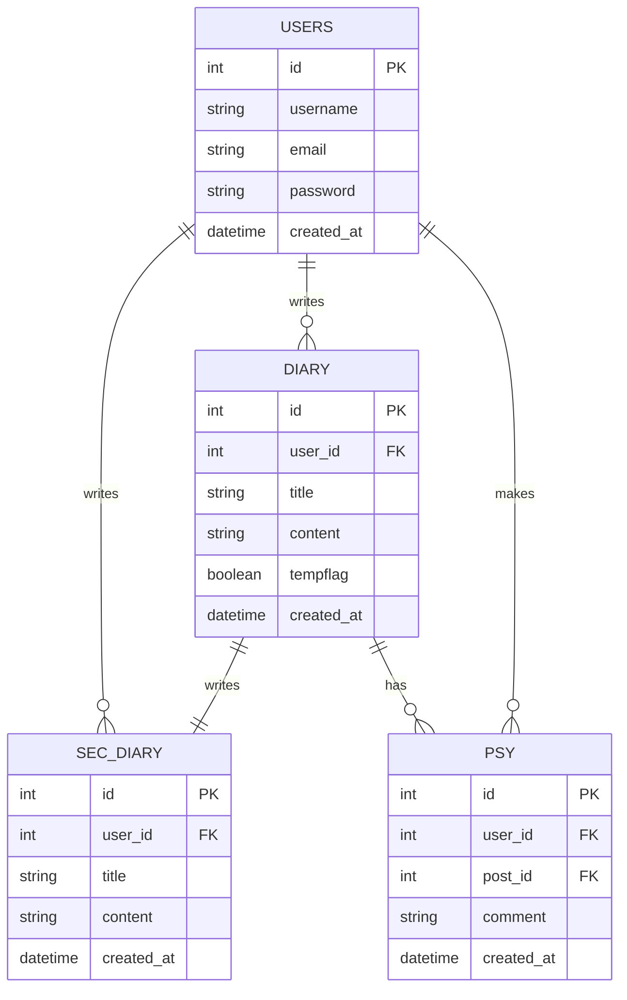

```mermaid
erDiagram
    USERS ||--o{ DIARY : writes
    DIARY ||--|| SEC_DIARY : writes
    USERS ||--o{ SEC_DIARY : writes
    USERS ||--o{ PSY : makes
    DIARY ||--o{ PSY : has

    USERS {
        int id PK
        string username
        string email
        string password
        datetime created_at
    }

    DIARY {
        int id PK
        int user_id FK
        string title
        string content
        boolean tempflag
        datetime created_at
    }
    SEC_DIARY {
        int id PK
        int user_id FK
        string title
        string content
        datetime created_at
    }
    PSY {
        int id PK
        int user_id FK
        int post_id FK
        string comment
        datetime created_at
    }
```
