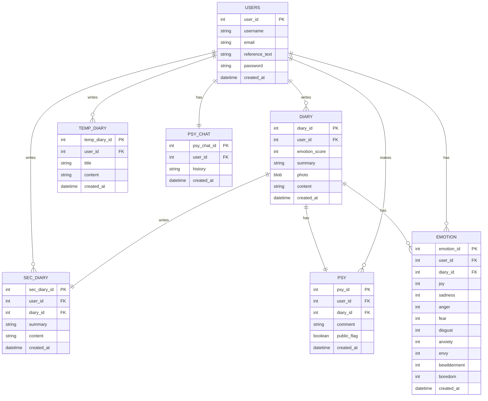

```mermaid
erDiagram
    USERS ||--o{ DIARY : writes
    USERS ||--o{ TEMP_DIARY : writes
    DIARY ||--|| SEC_DIARY : writes
    USERS ||--o{ SEC_DIARY : writes
    USERS ||--o{ PSY : makes
    DIARY ||--|| PSY : has
    USERS ||--|| PSY_CHAT : has
    USERS ||--o{ EMOTION : has
    DIARY ||--o{ EMOTION : has

    USERS {
        int user_id PK
        string username
        string email
        string reference_text
        string password
        datetime created_at
    }

    DIARY {
        int diary_id PK
        int user_id FK
        int emotion_score
        string summary
        blob photo
        string content
        datetime created_at
    }
    TEMP_DIARY {
        int temp_diary_id PK
        int user_id FK
        string title
        string content
        datetime created_at
    }

    EMOTION {
        int emotion_id PK
        int user_id FK
        int diary_id FK
        int joy
        int sadness
        int anger
        int fear
        int disgust
        int anxiety
        int envy
        int bewilderment
        int boredom
        datetime created_at
    }

    SEC_DIARY {
        int sec_diary_id PK
        int user_id FK
        int diary_id FK
        string summary
        string content
        datetime created_at
    }
    PSY {
        int psy_id PK
        int user_id FK
        int diary_id FK
        string comment
        boolean public_flag
        datetime created_at
    }
    PSY_CHAT {
        int psy_chat_id PK
        int user_id FK
        string history
        datetime created_at
    }
```
